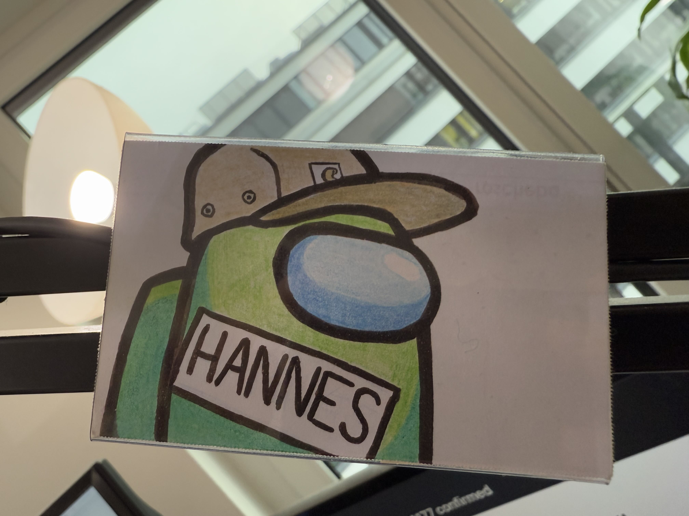
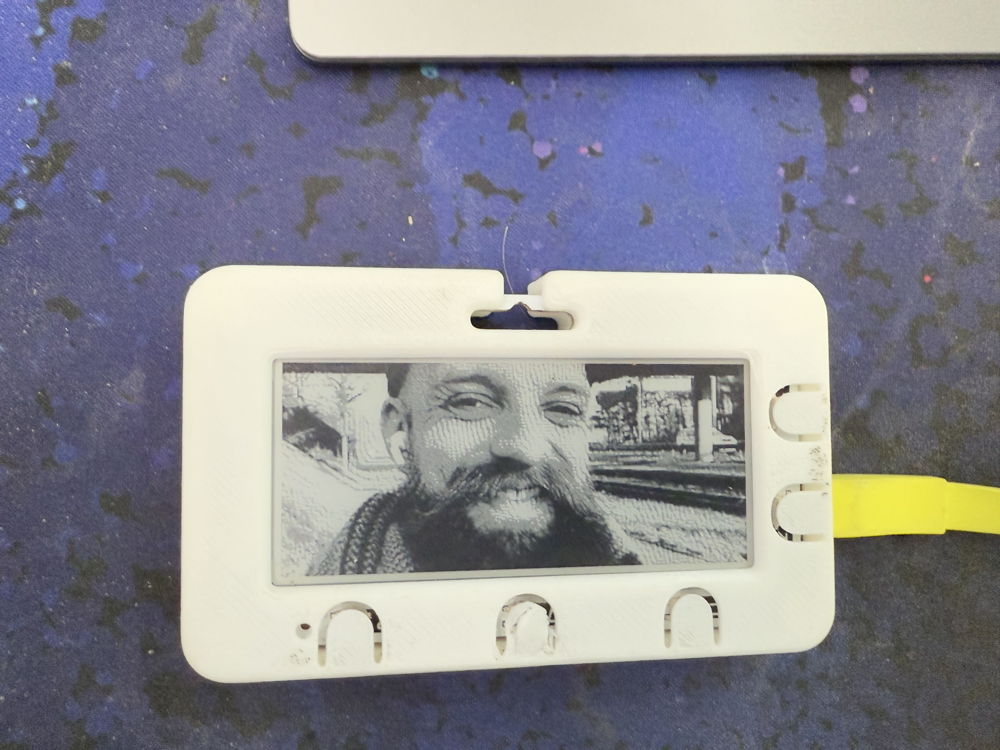
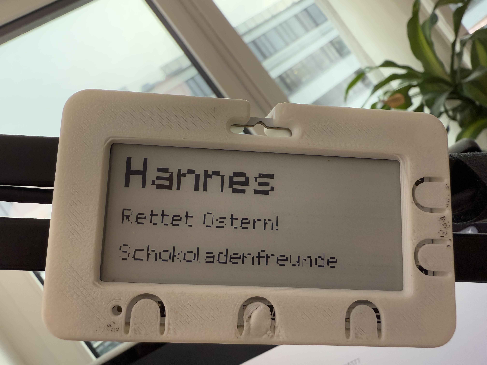

# E-Ink Name tags

I occasionlly participate in giving a curse for a [somer camp (german)](https://hsaka.de).
While at the camp every participant is required to wear a name tag.
Usually just a small paper in a plastic holder.
It's been a tradition to personalize the name tag to make it your own, this included writing the name you want to have, painting pictures or printing out new ones with funny in-jokes.


I didn't paint the one above, I wish my drawings were that good!

On one of these camps I had the idea of having an E-Ink name tag. That way I could update it live whenever I want!
Luck have it that I found the [Badger 2040W](https://shop.pimoroni.com/products/badger-2040-w?variant=40514062188627) just a few days later. A perfect fit!
Bought two (one for a friend), and went on hacking.

## Goals

My top most goal was to have a portable name tag that I can update.
Initially I had big plans of having different areas, that could host different "apps" or "plugins".
Examples I had in mind:
- Text
- Pictures
- A calender entry of the next event comming up
- Counters, that can be updated on the server

Text was (kinda) easy, some font rendering hickups on the server, but fine otherwise.

## Pictures

The display only has 2-bit color depth by default, meaning it can only display black or white.
I did notice that the python firmware for the Badger 2040 has different screen refresh modes (fast to slow, with different levels of "cleanness" in updating).
While playing around I figured out that by not making a clean refresh you could get different shades of gray!
It took some trial and playing around with how many different updates to do, but I landed on this update scheme:

```typescript

// aproximation of what colors I have available in gray scale
const availableColors = [
    255,
    250,
    240,
    235,
    230,
    227,
    221,

    101,
    70,
    55,
    45,
    38,
    30,
    20,
    10,
    0
]

// mapps from one of the colors above to an update sequence, to get that color
const map = [
        [0, 0, 0, 0, 0, 0, 0, 0, 0, 0, 0, 0, 0, 0, 0],
        [0, 0, 0, 0, 0, 0, 0, 0, 0, 0, 0, 0, 0, 1, 0],

        [0, 0, 0, 0, 0, 0, 0, 0, 0, 0, 0, 1, 1, 1, 0],
        [0, 0, 0, 0, 0, 0, 0, 0, 1, 1, 1, 1, 1, 1, 0],

        [0, 0, 0, 0, 0, 0, 1, 1, 1, 1, 1, 1, 1, 1, 0],
        [0, 0, 0, 0, 1, 1, 1, 1, 1, 1, 1, 1, 1, 1, 0],

        [0, 0, 1, 1, 1, 1, 1, 1, 1, 1, 1, 1, 1, 1, 0],
        [0, 0, 0, 0, 0, 0, 0, 0, 0, 0, 0, 0, 0, 0, 1],

        [0, 0, 0, 0, 0, 0, 0, 0, 0, 0, 0, 0, 0, 1, 1],
        [0, 0, 0, 0, 0, 0, 0, 0, 0, 0, 0, 0, 1, 1, 1],

        [0, 0, 0, 0, 0, 0, 0, 0, 0, 0, 1, 1, 1, 1, 1],
        [0, 0, 0, 0, 0, 0, 0, 0, 0, 1, 1, 1, 1, 1, 1],

        [0, 0, 0, 0, 0, 0, 0, 1, 1, 1, 1, 1, 1, 1, 1],
        [0, 0, 0, 0, 0, 1, 1, 1, 1, 1, 1, 1, 1, 1, 1],

        [0, 0, 0, 1, 1, 1, 1, 1, 1, 1, 1, 1, 1, 1, 1],
        [0, 1, 1, 1, 1, 1, 1, 1, 1, 1, 1, 1, 1, 1, 1],
    ]
```

By turning the pixel on and off, depending on the gray-tone I want, I can simulate a gray scale! It's not uniform in color depths (it has a lot more blacks and whites, and lacks in the middle-gray tones significantly).
But it's better than only black and white.
Combining this with dithering the input image you can get quite the nice images out of the device!




## Setup

At the end I had a small website, that I could update the text in and upload now pictures.
With a press of a button, the Badger would connect to the local wifi, download the newest image and display it.


## Compression
My first naive approach of downloading an `Boolean[][]`, was quickly failing, because of the size of the json response (woops).
Luckily the screen of the Badger itself is exactly 128 pixels high. 

Which caused the devs of the Badger to pack the memory representation of the pixel space in y, then x orientation (so scanning down, then left).
A bit unusual, which means I had to "flip" some arrays, but packing the pictures on the server and just pushing raw bytes over the wire significantly reduces the bandwidth!
Because I first did the compression and later on packet on the gray-scale trick, I opted to simply push over 15 images, and just have the client render all 15 in quick succession.
This is fairly simple, and takes up a lot of unnecessary space on the device, but it was very quick to implement.
I just push over an image that is 15 times as wide.
The client just pushes the correct index to the screen while updating. 

There is probably opportunity to save on space quite significantly.


## Future

I don't know.
I just ordered an [TRMNL](https://usetrmnl.com). They currently do not have a gray scale mode (which is part of the inspiration for this post, take this as free product feedback @trml!)
