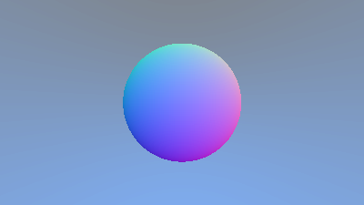

# Ray Tracer

A friend of mine recently did [ray Tracing in one weekend](https://raytracing.github.io/books/RayTracingInOneWeekend.html), and I got inspired to do the same.

In December of 2019 I did the annual [advent of code](https://adventofcode.com/2019). In that year you have to implement a VM, that can execute "intCode".
Inspired by that I decided to implement an Assembly language on top of that, and eventually even a "high level" language, that I call "intScript".

During the pandemic of 2020, I designed and implemented a hardware computer for intCode (blog post tbd).

If I complete the ray tracer in intScript, I in theory, would have done the full tech from wires to ray tracer all the way!


## Numbers

As the name intCode implies, the VM only deals with integers.
Which wouldn't be that big of a problem, if it had sufficient bit operations to implement something like IEEE 754 floating point numbers.
It's probably possible to do floating point numbers, but I have decided to try fixed point numbers instead.

Because the hardware i build uses 16 bit numbers, I decided to go with that as the basis of my aproach.

```
struct Fraction {
    integer: int,
    fraction: int
}
```
(int is the build in basic integer type).


`fraction` is in  `2^15th` parts of a whole number.
Because both parts can be 0, I need both to signify the sign of the number.

### Adding and Subtracting
Adding and subtracting is easy, just add or subtract the two parts:

```kotlin
fun addFrac(a: Fraction, b: Fraction): Fraction {
    val ret = Fraction(a.integer + b.integer, a.fraction + b.fraction )
    
    normalizeFrac(ret)
    return ret
}	

fun subFrac(a: Fraction, b: Fraction): Fraction {
    val ret = Fraction(a.integer - b.integer, a.fraction - b.fraction)

    normalizeFrac(ret)
    return ret
}
```

The normalization function, checks for overflow in the fraction part, and moves the overflow to the integer part,
as well as handle sign disagreements between the two parts.
```kotlin
fun normalizeFrac(a:Fraction) {
    if(a.fraction < MIN_INT | a.fraction == MIN_INT) {
        a.integer = a.integer - 1
        a.fraction = a.fraction - MIN_INT // on real hardware this needs to be different lol
    }
    if(a.fraction > MAX_INT | a.fraction == MAX_INT) {
        a.integer = a.integer + 1
        a.fraction = a.fraction - MAX_INT // on real hardware this needs to be different lol
    }
    if((a.integer < 0) & (a.fraction > 0)) {
        a.integer = a.integer + 1
        a.fraction = a.fraction - MAX_INT 
    }
    if((a.integer > 0) & (a.fraction < 0)) {
        a.integer = a.integer - 1
        a.fraction = a.fraction - MIN_INT 
    }
    return a
}
```

### Multiplication

Multiplication is a bit more tricky. The parts do interact with each other, and the result can be larger than 16 bits,
so we need to pultiply parts together and then add them together.

```kotlin
fun mulFracPart(a: int, b: int): Fraction {
    val ret = Fraction(0, 0)
    val upperA = a / 256
    val upperB = b / 256
    val lowerA = a - (upperA * 256)
    val lowerB = b - (upperB * 256)
    
    val Ab = (upperA * lowerB)
    val aB = (upperB * lowerA) 
    
    ret.integer = upperA * upperB
    ret.integer = ret.integer + Ab / 256
    ret.integer = ret.integer + aB / 256
    
    ret.fraction = lowerA * lowerB
    ret.fraction = ret.fraction + (Ab * 256) % 65536
    ret.fraction = ret.fraction + (aB * 256) % 65536 //(2^16)
    
    ret.integer = ret.integer * 2
    
    normalizeFrac(ret)
    return ret
}

fun mulFrac(a: Fraction, b: Fraction): Fraction {
    val ret = Fraction(0, 0)
    
    val Ab = mulFracPart(a.integer, b.fraction) 
    val aB = mulFracPart(a.fraction, b.integer) 
    val ab = mulFracPart(a.fraction, b.fraction)
    
    ret.integer = a.integer * b.integer
    ret.integer = ret.integer + Ab.integer + aB.integer 
    
    ret.fraction = ab.integer + Ab.fraction
    normalizeFrac(ret)
    ret.fraction = ret.fraction + aB.fraction
    
    normalizeFrac(ret)
    return ret
}
```

The intCode specification only has addition and multiplication in their specs.
When I first wrote the intScript compiler, I added what I called an "extended instruction set", which added division, modulo and a power operation.
Primarily because they save a lot of time. They all have polyfills in the compiler, that implements them using only addition and multiplication.

Sometimes i have to chuckle because a left shift in this architecture is "free" (a multiplication by 2^x, which is implemented in hardware, and therefor just as costly as an add or a comparison), but a right shift is not (a division by 2^x).

In most cases the precision is quire alright, but there is definitely room for improvements.

### Division
This was a tougher nut to crack. In the end the only idea I could come up with was in essence doing long division.
Because if how the checks work, this also means that each division is 32 multiplications (one for each bit in the `integer` and `fraction` variables).

```kotlin
fun compFrac(a: Fraction, b: Fraction): int {
    if(a.integer > b.integer) {
        return 1
    }
    if(a.integer < b.integer) {
        return -1
    }
    if(a.fraction > b.fraction) {
        return 1
    }
    if(a.fraction < b.fraction) {
        return -1
    }
    return 0
}

fun gtFrac(a: Fraction, b: Fraction): bool {
    if(compFrac(a,b) > 0) {
        return true
    }
    return false
}


val POWERS_OF_TWO = new int(16)
POWERS_OF_TWO[0] = 1
POWERS_OF_TWO[1] = 2
POWERS_OF_TWO[2] = 4
POWERS_OF_TWO[3] = 8
POWERS_OF_TWO[4] = 16
POWERS_OF_TWO[5] = 32
POWERS_OF_TWO[6] = 64
POWERS_OF_TWO[7] = 128
POWERS_OF_TWO[8] = 256
POWERS_OF_TWO[9] = 512
POWERS_OF_TWO[10] = 1024
POWERS_OF_TWO[11] = 2048
POWERS_OF_TWO[12] = 4096
POWERS_OF_TWO[13] = 8192
POWERS_OF_TWO[14] = 16384
POWERS_OF_TWO[15] = 32768

fun divFrac(aArg: Fraction, bArg:Fraction): Fraction {
     val a = Fraction(aArg.integer, aArg.fraction)
     val b = Fraction(bArg.integer, bArg.fraction)
     
     // ~ is the bitwise xor operator 
     val isNegative = (a.integer < 0 | a.fraction < 0) ~ (b.integer < 0 | b.fraction < 0)
     
     if (a.fraction < 0 | a.integer < 0) {
        a.integer = a.integer * -1
        a.fraction = a.fraction * -1
     }

     if (b.fraction < 0 | b.integer < 0) {
        b.integer = b.integer * -1
        b.fraction = b.fraction * -1
     }
     val res = Fraction(0,0)

     val i = 15
     while(i > -1) {
        res.integer = res.integer + POWERS_OF_TWO[i]
        val isBigger =  gtFrac( mulFrac(res,b) , a) 

        if (isBigger) {
            res.integer = res.integer - POWERS_OF_TWO[i]
        }

        i = i - 1
     }

     i = 15
     while(i > -1) {
        res.fraction = res.fraction + POWERS_OF_TWO[i]
        if(gtFrac(mulFrac(res, b), a)) {
            res.fraction = res.fraction - POWERS_OF_TWO[i]
        }

        i = i - 1
     }
     
     if(isNegative) {
        res.integer = 0 - res.integer
        res.fraction = 0 - res.fraction
    } 
    return res
}
```

### Square Root

Square root once you have multiplication and division is not that far away.
We do notice the precision issues more here, so I hardcoded a limit on how many rounds of refinement to do (50).
In practice, it seems to hold up so far.


## next up
The first images after this was quite nice to see.
I`ve broken the "in a weekend" part by quite a margin already. I feel it's gonna take some more as well.

Next post will probably be about how I got around the polymorphism issue in intScript. Once I decided on how.

In the meantime enjoy the first image I got out of the ray tracer, after a quick 6h 15min render, and only taking about 40 GB.


